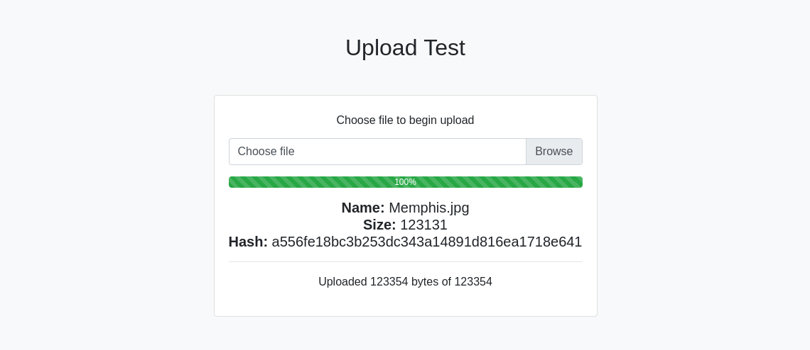

# Upload test for Cloudflare

It's a simple worker to test upload process in Cloudflare. This will get the file and calculate the SHA-1 hash of it and return it to you.

## Usage - CLI

```bash
curl -X POST -F 'file=@file.img' https://your.worker/
```

## Usage - Web

Just open your browser and go to your deployed worker.



## Support 💛

[](https://donatebadges.ir/donate/Bitcoin/bc1qmmh6vt366yzjt3grjxjjqynrrxs3frun8gnxrz)

[](https://donatebadges.ir/donate/Ethereum/0x0831bD72Ea8904B38Be9D6185Da2f930d6078094)

<div><a href="https://payping.ir/@hatamiarash7"></a></div>

## Contributing 🤝

Don't be shy and reach out to us if you want to contribute 😉

1. Fork it!
2. Create your feature branch: `git checkout -b my-new-feature`
3. Commit your changes: `git commit -am 'Add some feature'`
4. Push to the branch: `git push origin my-new-feature`
5. Submit a pull request

## Issues

Each project may have many problems. Contributing to the better development of this project by reporting them. 👍
